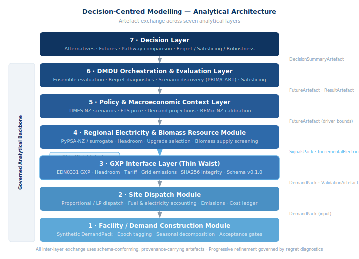
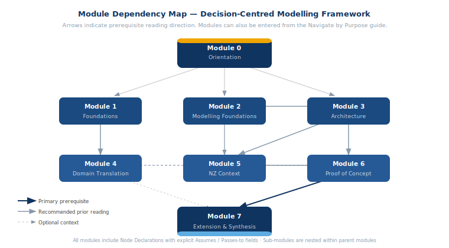

```{=html}
<!-- HERO BANNER -->
<div class="dcm-hero-wrap">
  <div class="dcm-hero-tag">
    A Framework for Complex Decisions Under Deep Uncertainty
  </div>
  <div class="dcm-hero-title">
    <strong>Decision-Centred Modelling</strong>
    <span style="font-size:0.65em; opacity:0.7; 
          display:block; margin-top:0.3rem;">
      (DCM)
    </span>
  </div>
  <p class="dcm-hero-sub">
    Foundations, Architecture, and Application to 
    Industrial Process Heat Decarbonisation
  </p>
  <p class="dcm-hero-motto">
    "The decision makes the boundary; the artefact makes the connection."
  </p>
  <a href="manuscript/module-0-orientation.html" class="dcm-btn dcm-btn-primary">
    Read the Framework →
  </a>
  <a href="https://github.com/Ahmad-Mahmoudi-coder/DCM" 
     class="dcm-btn dcm-btn-secondary" target="_blank">
    GitHub
  </a>
  <a href="https://github.com/Ahmad-Mahmoudi-coder/DCM/discussions" 
     class="dcm-btn dcm-btn-secondary" target="_blank">
    Discuss
  </a>
</div>

<!-- THE CENTRAL PROBLEM -->
<div style="max-width:860px; margin:0 auto; padding:0 2rem;">

<h2 style="font-family:'Helvetica Neue',Arial,sans-serif; 
           color:#0f3460; margin-top:2.5rem;">
  The Central Problem
</h2>
<p style="font-size:1.02rem; line-height:1.8; color:#2c2c3e; 
          max-width:720px;">
  Most planning problems look tractable until you realise that the 
  consequences which will determine whether your decision was right lie 
  <em>outside</em> the model you used to make it. Outside the physical 
  boundary. Outside the time horizon. Outside the organisational 
  perimeter. Outside the domain any single expert was trained to see.
</p>
<p style="font-size:1.02rem; line-height:1.8; color:#2c2c3e; 
          max-width:720px;">
  This framework is a response to that structural problem. It applies 
  to infrastructure planning, corporate strategy, policy design, 
  financial decisions, and anywhere that long-horizon commitments 
  interact with genuine uncertainty and multiple stakeholders who see 
  the same situation differently.
</p>

<!-- THREE QUESTIONS -->
<div class="dcm-q-block">
  <div class="dcm-q-label">Three Questions This Framework Addresses</div>

  <div class="dcm-q-row">
    <div class="dcm-q-circle">1</div>
    <div class="dcm-q-content">
      <strong>When should the boundary of your analysis be different 
      from the boundary of the system you are studying?</strong>
      Conventional modelling draws boundaries around what is physically 
      tractable. Decision-centred modelling draws them around what must 
      remain visible for the comparison to be valid — which is often 
      much larger, and almost always different.
    </div>
  </div>

  <div class="dcm-q-row">
    <div class="dcm-q-circle">2</div>
    <div class="dcm-q-content">
      <strong>How do you compare alternatives honestly when no one can 
      agree on the probability of the futures that determine which is 
      better?</strong>
      Not by assigning probabilities anyway and computing expected 
      values. By evaluating how each alternative behaves across the 
      full range of plausible futures — measuring regret, robustness, 
      and satisficing rather than a single weighted average outcome.
    </div>
  </div>

  <div class="dcm-q-row">
    <div class="dcm-q-circle">3</div>
    <div class="dcm-q-content">
      <strong>How do you build an environment that can grow toward 
      what matters without destroying what it has already 
      established?</strong>
      Through governed artefacts, stable interfaces, and progressive 
      refinement guided by what the diagnostics reveal as most 
      consequential next. The architecture is self-directing: at each 
      step, it reveals where the analytical torch should turn next.
    </div>
  </div>
</div>

<!-- THIS FRAMEWORK IS FOR -->
<h2 style="font-family:'Helvetica Neue',Arial,sans-serif; 
           color:#0f3460; margin-top:2rem; margin-bottom:1rem;">
  This Framework Is For
</h2>
<div class="dcm-audience-wrap">
  <div class="dcm-audience-item">
    <h4>Researchers</h4>
    <p>Working on DMDU, integrated assessment, and complex systems. 
    The architecture provides a modular, governed basis for 
    multi-scale exploration.</p>
  </div>
  <div class="dcm-audience-item">
    <h4>Practitioners</h4>
    <p>Infrastructure planners, energy analysts, and strategists 
    navigating long-horizon commitments under genuine uncertainty.</p>
  </div>
  <div class="dcm-audience-item">
    <h4>Policymakers</h4>
    <p>Seeking analyses that reveal system-level incentive 
    misalignments invisible to single-perspective assessments.</p>
  </div>
  <div class="dcm-audience-item">
    <h4>Anyone</h4>
    <p>Facing decisions where the most consequential outcomes lie 
    outside the frame you started with. The thinking applies 
    far beyond engineering.</p>
  </div>
</div>

<!-- FOUR PRINCIPLES -->
<h2 style="font-family:'Helvetica Neue',Arial,sans-serif; 
           color:#0f3460; margin-top:2rem; margin-bottom:1rem;">
  Four Principles
</h2>
<div class="dcm-pillar-wrap">
  <div class="dcm-pillar-card">
    <h3>Decision First</h3>
    <p>Boundaries are drawn by the decision context, not by physical 
    system extent. The model develops toward what influences the 
    decision, not toward completeness of the system description.</p>
  </div>
  <div class="dcm-pillar-card">
    <h3>Governed Artefacts</h3>
    <p>Every output that enters the comparison chain is 
    schema-conforming, provenance-carrying, and validation-gated. 
    Without governance, results cannot be trusted across versions 
    or questioned after the fact.</p>
  </div>
  <div class="dcm-pillar-card">
    <h3>Deep Uncertainty</h3>
    <p>When probabilities over futures are contested, the right 
    standard is robustness: how does this choice perform across the 
    range of conditions that cannot be agreed upon?</p>
  </div>
  <div class="dcm-pillar-card">
    <h3>Progressive Refinement</h3>
    <p>A bounded, honest starting point that reveals its own next 
    steps is more valuable than a comprehensive but opaque system. 
    The architecture is designed to grow toward what matters.</p>
  </div>
</div>

<!-- STATS -->
<div class="dcm-stats-wrap" style="margin-top:2.5rem;">
  <div class="dcm-stat-item">
    <div class="dcm-stat-n">8</div>
    <div class="dcm-stat-l">Modules from orientation to synthesis</div>
  </div>
  <div class="dcm-stat-item">
    <div class="dcm-stat-n">20</div>
    <div class="dcm-stat-l">Sub-modules with technical specifications</div>
  </div>
  <div class="dcm-stat-item">
    <div class="dcm-stat-n">11</div>
    <div class="dcm-stat-l">Propositions constituting the intellectual claim</div>
  </div>
  <div class="dcm-stat-item">
    <div class="dcm-stat-n">∞</div>
    <div class="dcm-stat-l">Domains this architecture can be applied to</div>
  </div>
</div>

<hr style="border:none; border-top:1px solid #dde6ef; margin:2.5rem 0;">

```

---

## The Framework at a Glance {.unnumbered}

```{=html}
<div style="margin:2rem 0;">
  <p style="font-size:0.88rem;color:#6b7a8d;margin-bottom:0.75rem;">
    <strong style="color:#0f3460;">Diagram 1:</strong> 
    Seven analytical layers — from facility demand 
    construction through the governed backbone to 
    the decision layer.
  </p>
  
</div>
<div style="margin:2rem 0;">
  <p style="font-size:0.88rem;color:#6b7a8d;margin-bottom:0.75rem;">
    <strong style="color:#0f3460;">Diagram 2:</strong> 
    Module dependency map — prerequisite reading 
    paths across Modules 0 through 7.
  </p>
  
</div>
```

```{=html}
<!-- NAVIGATE -->
<h2 style="font-family:'Helvetica Neue',Arial,sans-serif; 
           color:#0f3460; margin-bottom:1rem;">
  Navigate by Purpose
</h2>
<table>
  <thead>
    <tr><th>If you are...</th><th>Start here</th></tr>
  </thead>
  <tbody>
    <tr>
      <td>New to this framework — start here</td>
      <td><a href="manuscript/module-0-orientation.html">
      Module 0: Orientation (15 min)</a></td>
    </tr>
    <tr>
      <td>A researcher in DMDU, integrated assessment, 
      or systems modelling</td>
      <td><a href="manuscript/module-1-foundations.html">
      Module 1: Foundations</a></td>
    </tr>
    <tr>
      <td>An energy system modeller or tool developer</td>
      <td><a href="manuscript/module-3-architecture.html">
      Module 3: Architecture</a></td>
    </tr>
    <tr>
      <td>A practitioner or corporate strategist</td>
      <td><a href="manuscript/module-4-domain.html">
      Module 4: Domain Translation</a></td>
    </tr>
    <tr>
      <td>Working in NZ energy policy or infrastructure</td>
      <td><a href="manuscript/module-5-nz-context.html">
      Module 5: NZ Context</a></td>
    </tr>
    <tr>
      <td>Interested in the full proof of concept 
      and results</td>
      <td><a href="manuscript/module-6-poc.html">
      Module 6: Proof of Concept</a></td>
    </tr>
    <tr>
      <td>Evaluating the intellectual contribution</td>
      <td><a href="manuscript/module-7-synthesis.html">
      Module 7 §7.6: Eleven Propositions</a></td>
    </tr>
    <tr>
      <td>Thinking about applying this outside 
      energy systems</td>
      <td><a href="manuscript/module-7-synthesis.html">
      Module 7 §7.9: Beyond Infrastructure</a></td>
    </tr>
    <tr>
      <td>Wanting to contribute a domain extension</td>
      <td><a href="https://github.com/Ahmad-Mahmoudi-coder/DCM/discussions" 
      target="_blank">GitHub Discussions</a></td>
    </tr>
  </tbody>
</table>

<hr style="border:none; border-top:1px solid #dde6ef; margin:2rem 0;">

<p style="font-size:0.82rem; color:#888; 
          margin-bottom:3rem; margin-top:1rem;">
  <em>Seyed Ahmad Mahmoudi Lahijani — 2026</em>
  &nbsp;·&nbsp;
  <a href="https://github.com/Ahmad-Mahmoudi-coder/DCM">
  Repository</a> &nbsp;·&nbsp;
  <a href="https://github.com/Ahmad-Mahmoudi-coder/DCM/discussions">
  Contribute</a>
</p>

</div>
```
